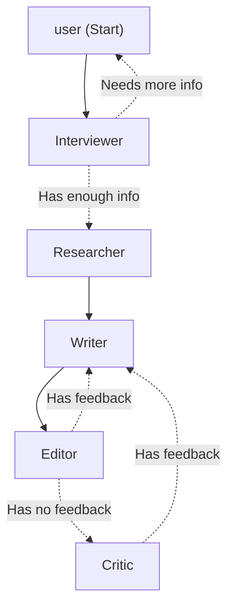

# Casper

⚠️ under construction ⚠️

This is my attempt at creating a small application that acts as my own personal ghost writer for [blog](https://blog.stevanfreeborn.com) content. It also serves as a great excuse to learn about and use the new [agent-framework](https://github.com/microsoft/agent-framework) from Microsoft.

## Workflow

